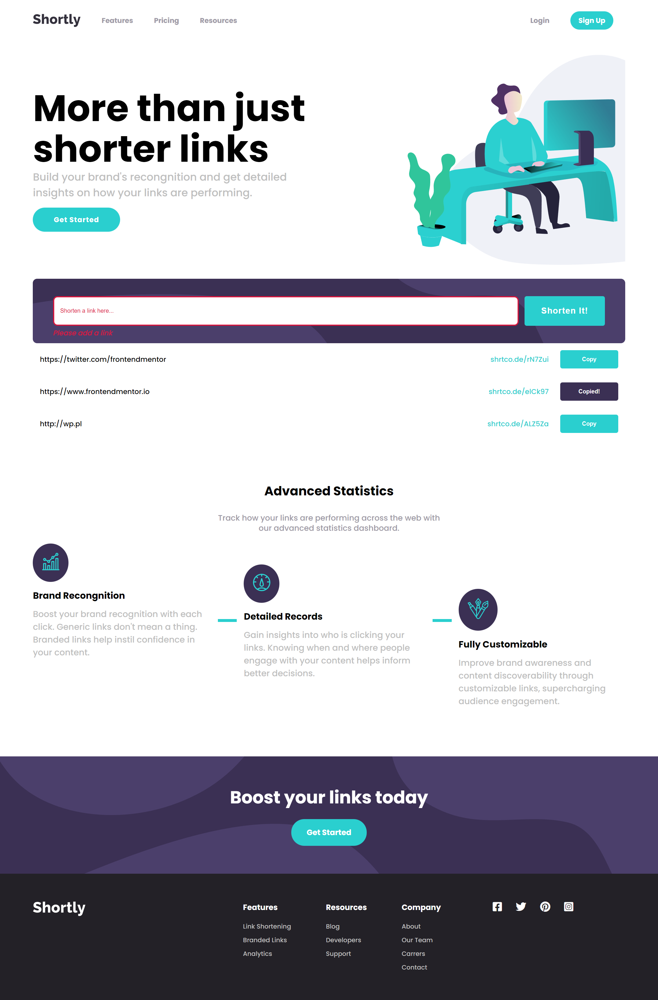

# Frontend Mentor - Shortly URL shortening API Challenge solution

This is a solution to the [Shortly URL shortening API Challenge challenge on Frontend Mentor](https://www.frontendmentor.io/challenges/url-shortening-api-landing-page-2ce3ob-G). Frontend Mentor challenges help you improve your coding skills by building realistic projects. 

## Table of contents

- [Overview](#overview)
  - [The challenge](#the-challenge)
  - [Screenshot](#screenshot)
  - [Links](#links)
- [My process](#my-process)
  - [Built with](#built-with)
  - [What I learned](#what-i-learned)
  - [Continued development](#continued-development)
- [Author](#author)

## Overview

### The challenge

Users should be able to:

- View the optimal layout for the site depending on their device's screen size
- Shorten any valid URL
- See a list of their shortened links, even after refreshing the browser
- Copy the shortened link to their clipboard in a single click
- Receive an error message when the `form` is submitted if:
  - The `input` field is empty

### Screenshot



### Links

- Solution URL: [https://github.com/kamiliano1/ShortlyURL](https://github.com/kamiliano1/ShortlyURL)
- Live Site URL: [https://curious-raindrop-52f920.netlify.app/](https://curious-raindrop-52f920.netlify.app/)

## My process

### Built with

- Semantic HTML5 markup
- CSS custom properties
- Flexbox
- Mobile-first workflow
- [React](https://reactjs.org/) - JS library
- [Vite](https://vitejs.dev/) - Vite
- [Next.js](https://nextjs.org/) - React framework
- [Font Awesome](https://fontawesome.com)


### What I learned

This challenge was very usefull to check my knowlage about CSS and check in which area I need more practice. Additionaly working with the API give me more experience to work and to see .catch in practice:

```js
.catch((error) => {
    console.error('Error:', error)
  })
```

### Continued development

The layout and the form to short the links are done but CSS file might by DRYer.
So in the future I will refactor CSS and JSX files.

I'm not saticfied with the rounded icons. The icons are not completly centered.
Also I wasn't sure how to do correctly the hover and focus efects on the buttons,
I've used only: 
```css
.buttons {
  opacity: .5;
}
```
## Author

- Website - [Kamil Szymon](https://github.com/kamiliano1)
- Frontend Mentor - [@kamiliano1](hhttps://www.frontendmentor.io/profile/kamiliano1)
